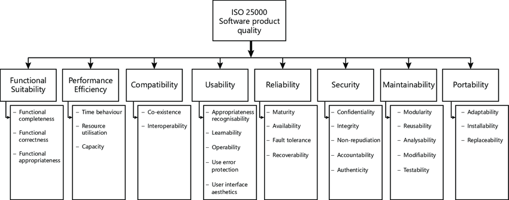
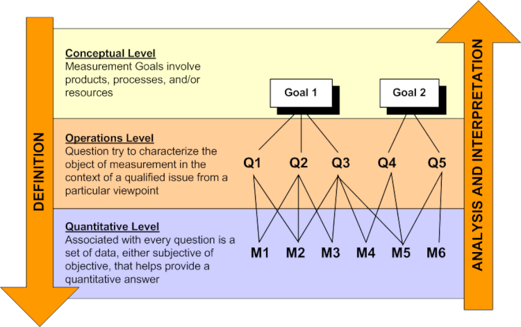
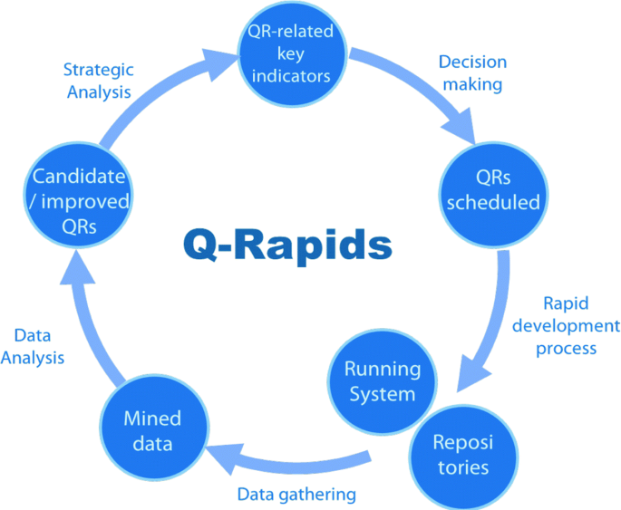

# Fase 1 -  Estabelecer os requisitos de avaliação

## 1. Propósito da avaliação

### 1.1 Produto, domínio e versão a ser analisado:

O produto a ser analisado é o [AgroMart](https://agromart.github.io/docs/), especificamente a sua [API](https://github.com/AgroMart/api) na versão 0.1.0.

#### Nome do Produto:
Agromart

#### Resumo do Projeto:**
O Agromart é uma plataforma digital criada para conectar agricultores familiares a consumidores, facilitando a divulgação e comercialização de produtos agrícolas, especialmente no contexto de isolamento social gerado pela pandemia da COVID-19. A solução inclui um aplicativo para agricultores divulgarem seus produtos e uma interface voltada para consumidores encontrarem e contatarem produtores locais.

#### Objetivo Principal:
Promover o acesso direto entre agricultores familiares e consumidores, fortalecendo as Comunidades que Sustentam a Agricultura (CSAs) por meio da tecnologia.

#### Público-Alvo:

Primário: Agricultores familiares e co-agricultores participantes de CSAs.

Secundário: Consumidores interessados em produtos locais e orgânicos, com foco em alimentação saudável e apoio à agricultura sustentável.

#### Problemas que Resolve:

- Falta de visibilidade dos produtos dos agricultores.
- Dificuldade de contato direto entre produtores e consumidores.
- Necessidade de adaptar a comercialização ao contexto digital.
- Ausência de plataformas específicas para CSAs.
- Funcionalidades-Chave:
- Cadastro de pontos de venda com produtos, preços, localização e contatos.
- Busca por lojas próximas usando mapas e filtros.
- Contato direto via aplicativo de mensagens.
- Integração com meio de pagamento digital.
- Plataforma web para gestão e acompanhamento.
- App dedicado para co-agricultores.

#### Diferenciais:

- Foco em CSAs e agricultura familiar.
- Design orientado à usabilidade e contexto rural.
- Abordagem open source, permitindo colaboração e transparência.
- Envolvimento contínuo de professores e estudantes da UnB-FGA.

#### Estágio Atual:
Em desenvolvimento contínuo com versão open source, integração com meios de pagamento e apoio institucional da UnB-FGA.

### 1.2 Objetivo em relação a avaliação

O objetivo é obter um laudo técnico sobre sua qualidade, indicar pontos para melhoria e adequar o produto às normas de qualidade.

### 1.3 Aspectos de qualidade a serem avaliados

Dentre os critérios definidos pela norma ISO/IEC 25010, escolhemos priorizar **manutenibilidade**, **confiabilidade** e **segurança**, devido à baixa cobertura de testes automatizados na aplicação, o que torna esses aspectos críticos para garantir a estabilidade e evolução segura do sistema.

A tabela abaixo apresenta o nível de interesse atribuído a cada aspecto de qualidade, em uma escala de 1 (pouco interesse) a 5 (grande interesse):

| Aspecto de Qualidade      | Nível de Interesse |
| ------------------------- | ------------------ |
| Manutenibilidade          | 5                  |
| Segurança                 | 4                  |
| Confiabilidade            | 4                  |
| Eficiência de performance | 2                  |
| Compatibilidade           | 2                  |
| Adequação Funcional       | 1                  |
| Usabilidade               | 1                  |
| Portabilidade             | 1                  |

## 2. Tipo de produto a ser avaliado

### 2.1 Descrição geral do produto, ambiente e dados

O AgroMart possui **26 funcionalidades** no total, sendo **15 voltadas para co-agricultores** e **11 para administradores**. As principais funcionalidades incluem:

#### 🛒 Compras:
- Adicionar ao carrinho
- Comprar cesta
- Comprar produto
- Comprar planos

#### ⚙️ Gerenciamento:
- Interagir com Produtos
- Interagir com Cestas
- Interagir com Co-agricultores
- Interagir com Pedidos

Estas funções concentram o uso principal da aplicação e, por isso, serão o foco da avaliação.

#### 👤 Usuários
O público-alvo são pessoas com **pouco conhecimento técnico** em informática. Apenas o **administrador (agricultor)** precisa ter maior familiaridade com a aplicação para cadastrar produtos, gerenciar pedidos e interagir com demais usuários.

#### 🔍 Escopo da Avaliação
A análise será focada principalmente na **API**, utilizando como **massa de dados** o próprio **código** disponível no GitHub e dados iniciais fornecidos pela aplicação.

#### 💻 Janelas de interação mais relevantes:
- Tela de cadastro e login
- Tela de compras (produtos, cestas, planos)
- Área de notificações e histórico
- Painel do administrador (produtos, co-agricultores, lojas)

### 2.2 Categoria do produto

O produto se enquadra no modelo de Pressman como um **Software Comercial** por ter uma demanda de mercado para realizar automações da sociedade e oferece soluções para a área do agronegócio.

Já na IEEE 1062 o produto se enquadraria no tipo **COTS (Commercial Off-The-Shelf-Software)** já que os requisitos dependem de vários usuários e não tem distinção entre clientes. Todos usam o mesmo produto. 

## Modelo de qualidade

A equipe irá utilizar o modelo de qualidade **Square**, junto com as metologias **Q-Rapids** e **GQM**.

### SQUARE:

### GQM:

### Q-Rapids:
