# GQM - Fase Definição

## Objetivo de Negócio do AGROMART

**Melhorar a manutenibilidade do sistema AGROMART**, com foco especial na redução da complexidade do código e na testabilidade, garantindo que a equipe de desenvolvimento (incluindo novos membros) possa realizar modificações, correções e expansões com autonomia, eficiência e baixo risco de introdução de erros.

---

## Objetivo de Medição 1: Verificar manutenibilidade do AGROMART

| Elemento           | Descrição                           |
| ------------------ | ----------------------------------- |
| **Analisar**       | AGROMART                            |
| **Propósito**      | AVALIAR                             |
| **Respeito a**     | MANUTENIBILIDADE                    |
| **Ponto de Vista** | EQUIPE DE DESENVOLVIMENTO           |
| **Contexto**       | DISCIPLINA DE QUALIDADE DE SOFTWARE |

### Questões e Hipóteses

| Questão (Q)                             | Hipótese Associada                                                 |
| --------------------------------------- | ------------------------------------------------------------------ |
| **Q1:** Quão modular está o código?     | Velocidade de refatoração e melhoria de teste.                     |
| **Q2:** Quão fácil é entender o código? | Tempo de desenvolvimento e integração com o time.                  |
| **Q3:** Como está a testabilidade?      | Quanto maior a testabilidade, menor a chance de erros em produção. |

## Folha de Abstração

| Campo                               | Descrição                                                                                                                                                                                         |
| ----------------------------------- | ------------------------------------------------------------------------------------------------------------------------------------------------------------------------------------------------- |
| **Objeto**                          | Código-fonte do sistema AGROMART                                                                                                                                                                  |
| **Propósito**                       | Avaliar a capacidade de manutenção e evolução do código                                                                                                                                           |
| **Ponto de Vista**                  | Equipe de desenvolvimento (incluindo novos membros)                                                                                                                                               |
| **Foco da Qualidade**               | - **Modularidade**: Nº de módulos independentes e acoplamento - **Legibilidade**: Complexidade ciclomática e documentação - **Testabilidade**: Cobertura de testes e tempo para criar novos |
| **Hipóteses de Referência**         | - Módulos bem definidos reduzem 30% do tempo de refatoração - Complexidade < 5 diminui 50% dos erros de lógica - Cobertura > 80% reduz falhas em 40%                                        |
| **Fatores de Variação**             | - Experiência da equipe - Ferramentas (SonarQube, ESLint) - Frequência de revisões - Tempo de refatoração                                                                                |
| **Impacto dos Fatores de Variação** | - Revisões semanais: -25% retrabalho - Ferramentas: +40% detecção de bugs - Onboarding: -35% tempo de adaptação                                                                             |

## Diagrama 1

## Histórico de Versão

|    Data    | Versão |          Descrição          |                  Autor(es)                   | Data de revisão |                  Revisor(es)                  |
| :--------: | :----: | :-------------------------: | :------------------------------------------: | :-------------: | :-------------------------------------------: |
| 19/05/2025 |  1.0   | Versão inicial de documento | [José Filipi](https://github.com/JoseFilipi) |   19/05/2025    | [Cauã Corrêa](https://github.com/CauaMatheus) |
